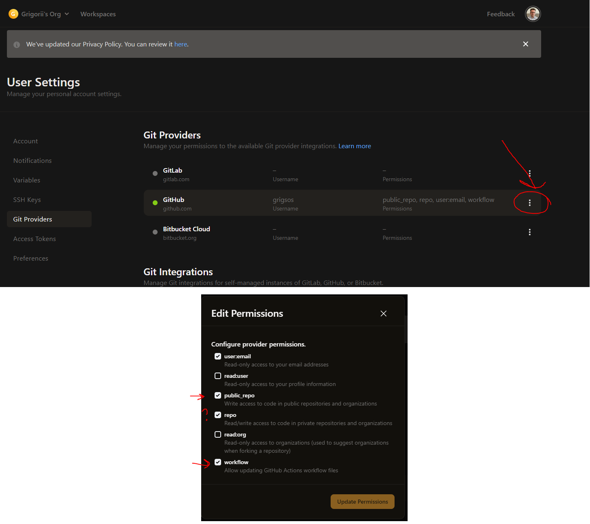

# Setup Instructions

1. Go to [GitPod Integrations page](https://gitpod.io/user/integrations): 

    - Authenticate with GitHub and allow for workflows and public repositories to be accessed by GitPod. 
    - (Optional) You can also allow for private repositories to be accessed by GitPod if you want today's session to be private.

    For picture assistance go to section: [Extras](#extras)

2. Authenticate into your personal account with GitHub CLI that is already installed`gh auth login`. For every choice selection you can just press enter, or if you would like to read closely:
    - GitHub.com
    - HTTPS
    - Yes
    - Login with a web browser
    
    You will likely need your phone if you have double authentication required.


3. We will create a new repository with the following command:
    ```bash
    gh repo create github-cicd-workshop --public
    ```
    - You can replace `github-cicd-workshop` with any name you want for your repository. This will be defined as <SELECTED-REPO-NAME> in the next step.
    - You can also change `--public` to `--private` if you want to make it private.

4. The repo that was created is currently empty. We will push this git repo to be the master branch with the following commands:
    ```bash
    git remote add origin https://github.com/<YOUR-GITHUB-USERNAME-HERE>/<SELECTED-REPO-NAME>.git
    git push --set-upstream origin master
    ```


### Extras

GitPod picture:

